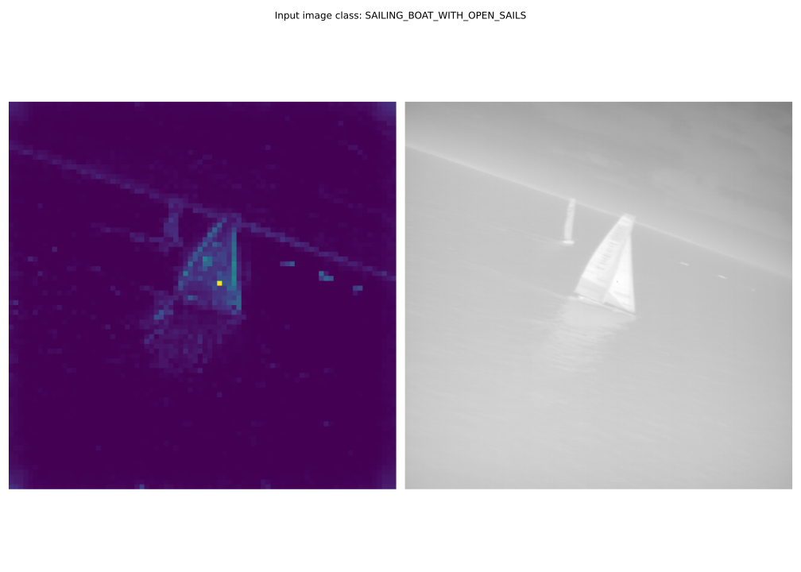
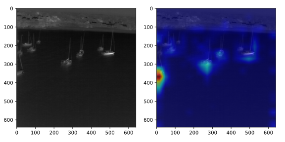
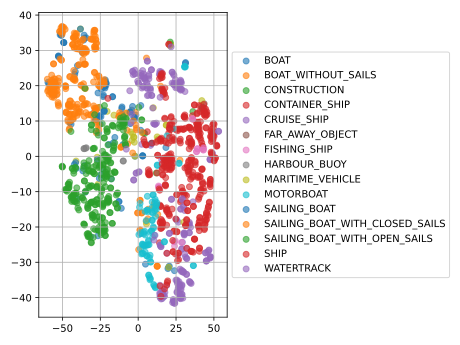
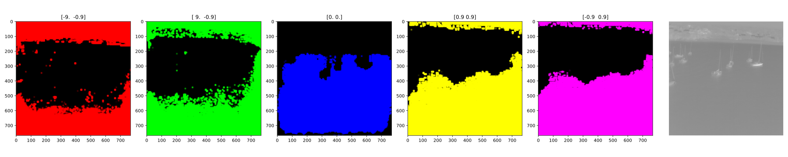
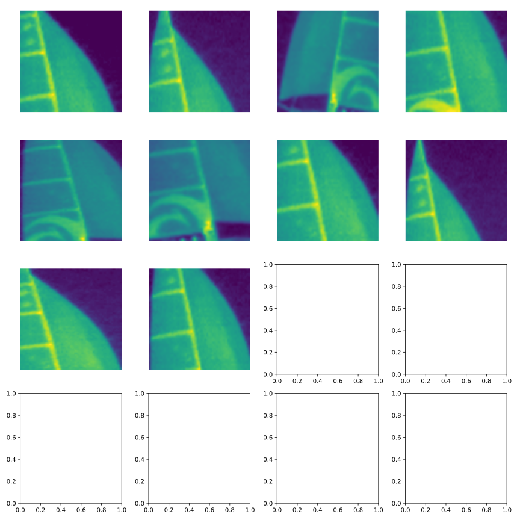

# SSL_MFE

Self-Supervised Learning for Robust Maritime IR/Vision Feature Extraction

## Prerequisites

#### Datasets

- Optionally download CIFAR10-C eval dataset from [here](https://zenodo.org/record/2535967#.XqZQ9hNKjIU) and put it in
  the `data`
  folder.
- [ ] TODO: add full support for mounting the nas (currently not on main and fully tested)

## Setup

Make a venv and install the requirements:

```shell
python3 -m venv venv
source venv/bin/activate
pip install -r requirements.txt
```

## Usage

This repo provides different training scripts for different self-supervised learning methods.
The scripts all support most of the available models of the `timm` library. You can find a list of all
available models [here](https://github.com/huggingface/pytorch-image-models#models).

For each training method, the scripts implement KNN evaluation and different visualization methods.
For ViT models, you can visualize the attention maps of the transformer layers. 



For ConvNeXt models, you can visualize the attention maps of the convolutional layers. 



For all models we visualize TSNE embeddings of the last layer of the model.



You can run each script using the `--help` flag to see all available options.

> **_NOTE:_** For all methods you can optionally track experiments and model checkpoints using Weights & Biases.
> To do so, you need to create an account and login via the wandb cli. Then, you can run the training
> scripts with the `--wandb` flag. For an example you can take a look at one
> of [my workspaces](https://wandb.ai/mcaaroni/dino).

The following methods are currently implemented:

### DINO Training

Here is an example for training a self-supervised ConvNeXt model:

```shell 
python train_ssl.py --model convnext_tiny --eval --visualize grad_cam --optimizer lars --weight_decay 1e-6 --weight_decay_end 1e-6 --learning_rate 0.48 --min_lr 0.0048 --epochs 1000 --local_crop_input_factor 1 --num_workers 12 --batch_size 256 --wandb
```

### Contrastive Training

To run contrastive learning methods you can use the `train_contrastive.py` script. You can either train using self-supervised
or supervised contrastive learning. For self-supervised contrastive learning, you can supply the method using the `--method` flag.

Here is an example for training a self-supervised ConvNeXt model:

```shell
python train_contrastive.py --model convnext_atto --eval --visualize grad_cam --input_channels 1 --dataset fashion-mnist --method simclr
```

And here for supervised contrastive training using a MobileNetV3 model:

```shell
python train_contrastive.py --model mobilenetv3_small_100 --eval --visualize grad_cam --input_channels 1 --dataset fashion-mnist --method supcon
```


### Linear Probing

To run linear probing experiments you can use the `train_linear.py` script. 
It loads a pretrained model if possible and trains a linear classifier on top of it.

Here is an example for training a linear classifier on top of a self-supervised ConvNeXt model:

> **_NOTE:_** Make sure to provide the amount of classes of the dataset you want to train on using the `--num_classes` flag.

```shell
python train_linear.py --model convnext_tiny --eval --input_channels 1 --dataset fashion-mnist --num_classes 10
```


### Tracking 

If you're not using Weights & Biases, you can still track the training progress using tensorboard.

```shell
tensorboard --logdir=tb_logs
```


### Visualization

> **_NOTE:_** You can use the `--timm` flag to use a pretrained model from the `timm` library.

All visualizations can also be run standalone using the `visualize.py` script. 
For example, to visualize the attention maps of a self-supervised ViT model, you can run:


```shell
python visualize.py --visualize dino_attn --model vit_tiny --timm --input_size 480
```

Additionally to the visualizations in the training scripts, the standalone script also supports
projections of anchor points of DINO embeddings, similar to the method described in STEGO.

```shell
python visualize.py --visualize dino_proj --model vit_base --dataset fiftyone --input_channels 3 \
                    --patch_size 8 --input_size 224 --timm --img_path $/path/to/img
```



And you can visualize the preprocessing augmentations of the dataset when training with DINO:

```shell
python visualize.py --visualize dino_augs --dataset fiftyone --input_channels 1 --input_size 224
```




<details>
<summary>Click to expand more training examples</summary>

Train self-supervised ConvNeXt model:

```shell
python train_ssl.py --device cuda --model convnext_tiny --optimizer adamw --epochs 100 --local_crops_scale 0.2 0.5 --global_crops_scale 0.7 1. --in_dim 2048
```

Train self-supervised ViT model:

```shell
 python train_ssl.py --device cuda --model vit_tiny --eval --visualize dino_attn
```

Train self-supervised ResNet model:

```shell
python train_ssl.py --device cuda --model resnet26_dino_cifar10 --eval --visualize grad_cam
```

Train self-supervised MobileNetV3 model:

```shell
python train_ssl.py --model mobilenetv3_small_100 --batch_size 512 --eval --visualize grad_cam --optimizer lars --weight_decay 1e-5 --weight_decay_end 1e-5 --learning_rate 0.48 --norm_last_layer --wandb
```

Train self-supervised ConvNeXt on fashion-mnist:

```shell
python train_ssl.py --device cuda --model convnext_pico --optimizer adamw --epochs 200 --batch_size 128 --learning_rate 0.03 --local_crops_scale 0.2 0.5 --global_crops_scale 0.7 1. --num_classes 0 --weight_decay 1e-4 --weight_decay_end 1e-4 --dataset fashion-mnist --input_channels 1 --input_size 32 --in_dim 512
```

Visualize DINO attention maps:

```shell
python visualize.py --visualize dino_attn --model vit_tiny --ckpt_path tb_logs/dino/vit_tiny_e100_b32_oadamw_lr0.0001_wd0.040000/best.pth --input_size 480
```

</details>

## Notes

### TODOs

- [x] try loss landscapes with pre-trained model and compare to reference
- [x] implement cifar10-c evaluation
- [x] try out whole pipeline for simple model
- [x] implement visualization for attention maps
- [x] implement dino paper first version
- [x] implement proper consine scheduling, warmup, LR decay, weight decay, temperature decay
- [x] test dino with resnet -> convnext
- [x] integrate official dino paper attn visualization
- [x] add vit impl from dino paper
- [x] ~~fix tensorboard embedding visualizations~~ -> tsne instead
- [x] cleanup experiment tracking (naming/saving models/saving plots/folder structure/timestamps)
- [ ] improve logfiles
- [x] try out and add mobile-vit
- [ ] try out guild ai
- [ ] log representation to check for collapse of model
- [x] log loss per epoch
- [x] overfit on single batch
- [x] add continue from checkpoint
- [ ] add wandb run resuming
- [x] add train scripts for finetuning self-supervised models
- [x] add fixed seeds
- [x] implement LARS optim
- [ ] implement contrastive learning script
- [ ] try out LeVit
- [ ] implement knn from [here](https://github.com/zhirongw/lemniscate.pytorch/blob/master/test.py) and check for
  speedup

- [ ] linear probe best performing CIFAR10 model (convnext-tiny vs. vit-tiny)
- [ ] retrain convnext-tiny with larger batches for more epochs (args from `solar-rain-44` on w&b)
- [ ] compare convnext-pico/atto/femto/tiny on CIFAR10
- [ ] retrain mobilevitv2 on CIFAR10 for more epochs (args from `stilted-frost-53` on w&b)
